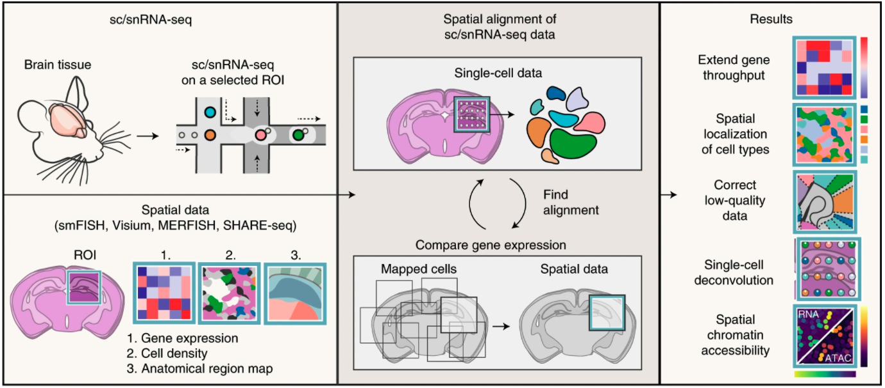

# Deep Spatial Genomics

Pytorch implementations of deep learning methods for spatial genomic data.

This project is intended to harmonize tasks for published methods and speed-up deep learning-based spatial genomics methods development.

For detailed documentation see the [project website](github.pages.link)

## Install

```bash
pip install deep-spatial-genomics
```

Note: If you are running into installation issues due to the scanpy dependency you can install with Conda via the `env.yaml` file. Note that if your version of CUDA is not x.x you will need to specify the correct cudatoolkit version in the `env.yaml` file.

```bash
conda env create -f env.yaml
conda activate deep-spatial-genomics
```

Most tools also have [google colab notebooks](https://colab.research.google.com/).

## Tools

+ [Tangram](#Tangram)

## Tasks

+ Voxel (spot) deconvolution
  + Tools: [Tangram](#Voxel-deconvolution-with-Tangram)
+ Mapping single cell data to spatial coordinates
  + Tools: [Tangram](#single-cell-mapping-with-Tangram) 
+ Smoothing/imputation of spatial genomic data
  + Tools: [Tangram](#smoothing-of-spatial-genomic-data-with-Tangram) 
+ Embedding single cell and spatial genomic data
+ Voxel-Voxel interactions
+ Cell-Cell interactions

#### Tangram

</img>

Blurb

[Paper](https://www.nature.com/articles/s41592-021-01264-7)

[Original repository](https://github.com/broadinstitute/Tangram)

[Detailed documentation]()

[Colab notebook]()

###### Training model

```python
example code
```

###### Voxel deconvolution with Tangram

```python
example code
```

###### Single cell mapping with Tangram

```python
example code
```

###### Smoothing of spatial genomic data with Tangram

```python
example code
```

## Citations

```bibtex
@article{biancalani2021deep,
  title={Deep learning and alignment of spatially resolved single-cell transcriptomes with Tangram},
  author={Biancalani, Tommaso and Scalia, Gabriele and Buffoni, Lorenzo and Avasthi, Raghav and Lu, Ziqing and Sanger, Aman and Tokcan, Neriman and Vanderburg, Charles R and Segerstolpe, {\AA}sa and Zhang, Meng and others},
  journal={Nature methods},
  volume={18},
  number={11},
  pages={1352--1362},
  year={2021},
  publisher={Nature Publishing Group}
}
```


